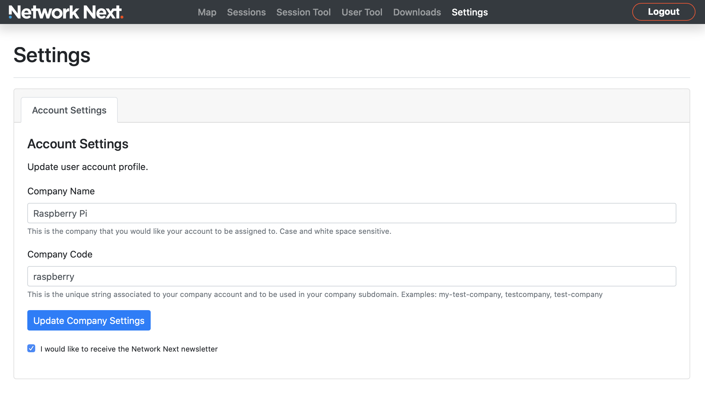

Getting Started
===============

1. Sign up to the portal
------------------------

Sign up and create an account at https://portal.networknext.com by clicking "Get Access".

.. image:: images/get_access.png

2. Download the SDK
-------------------

Once you've signed up you get access to the "Downloads" page. Here you can download the latest SDK.

.. image:: images/downloads.png

3. Generate a keypair
---------------------

Inside the SDK there is a keygen tool under the "keygen" directory.

Run the keygen to generate a keypair for your company.

You'll see something like this:

.. code-block:: console

	Welcome to Network Next!

	This is your public key:

	    OGivr2IM0k7oLTQ3lmGXVnZJpxDRPFsZrKxYLn7fQAosTpQAfs464w==

	This is your private key:

	    OGivr2IM0k4lCfbM/VZCVK99KkDSCbzi8fzM2WnZCQb7R6k4UHc51+gtNDeWYZdWdkmnENE8WxmsrFguft9ACixOlAB+zjrj

	IMPORTANT: Save your private key in a secure place and don't share it with anybody, not even us!

4. Setup your company in the portal
-----------------------------------

Go to the "Settings" page in the portal and enter your company name and company code

For example:

4. Enter your public key in the portal
--------------------------------------

Once your company is setup, you the "Game Configuration" tab is revealed.

Select it and enter your public key from the keygen to link your keypair with your account:

.. image:: images/game_settings_public_key.png

5. Set your public key on the client
------------------------------------

The client needs only your public key to associate with your account. It's safe to share your public key outside your company.

In the *upgraded_client.cpp* example, replace the test customer public key with your own:

.. code-block:: c++

	const char * customer_public_key = "leN7D7+9vr24uT4f1Ba8PEEvIQA/UkGZLlT+sdeLRHKsVqaZq723Zw==";

5. Set your private key on the server
-------------------------------------

The server needs your private key to associate with your account.

Can change the code in the *upgraded_server.cpp* example:

.. code-block:: c++

	const char * customer_private_key = "OGivr2IM0k4lCfbM/VZCVK99KkDSCbzi8fzM2WnZCQb7R6k4UHc51+gtNDeWYZdWdkmnENE8WxmsrFguft9ACixOlAB+zjrj";

Or pass it in with an environment variable:

.. code-block:: console

	export NEXT_CUSTOMER_PRIVATE_KEY=OGivr2IM0k4lCfbM/VZCVK99KkDSCbzi8fzM2WnZCQb7R6k4UHc51+gtNDeWYZdWdkmnENE8WxmsrFguft9ACixOlAB+zjrj

6. Build and run a client and server
------------------------------------

Now you should now be able to run the upgraded client and server and see the session show up in the portal. 

Make sure to run the server on a public IP address because it will not work if it is behind NAT.

The server output should look like this:

(Image showing server output)

And the client output should look like this:

(Image showing client output)

7. See your session in the portal
---------------------------------

You should see a dot on your map at your location:

(Example image showing the dot)

And in the top sessions page you will see your session showing up:

(Example image showing session)

You can drill in on the session and see your latency, jitter and packet loss over time:

(Image showing session drill in)

8. Welcome to Network Next!
---------------------------

Congratulations! Your account is now fully setup.

We look forward to working with you. 

Please reach out to support@networknext.com and we'll guide you through the rest of your integration and launch.

cheers

- Glenn Fiedler, Founder and CEO, Network Next
