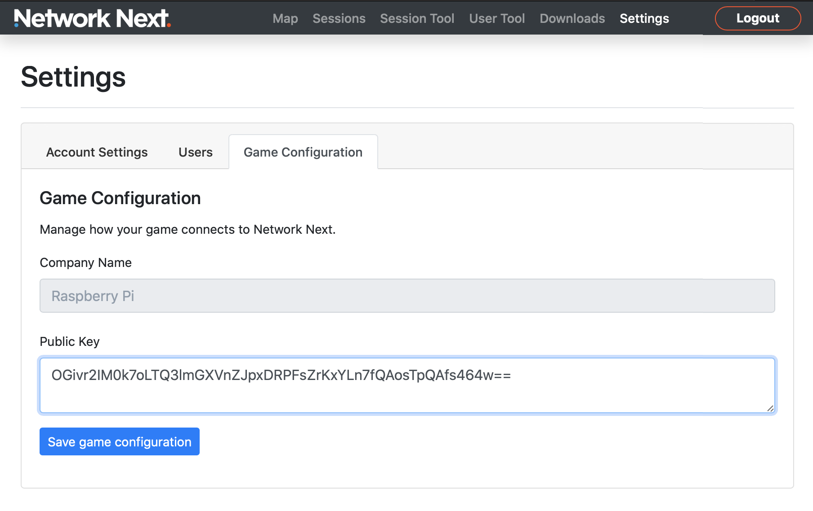

Getting Started
===============

1. Sign up to the portal
------------------------

Sign up and create an account at https://portal.networknext.com by clicking "Get Access".

.. image:: images/get_access.png

2. Download the SDK
-------------------

Once you've signed up you get access to the "Downloads" page. Here you can download the latest SDK.

.. image:: images/downloads.png

3. Generate a keypair
---------------------

Inside the SDK there is a keygen tool under the "keygen" directory.

Run the keygen to generate a keypair for your company.

You'll see something like this:

.. code-block:: console

	Welcome to Network Next!

	This is your public key:

	    OGivr2IM0k7oLTQ3lmGXVnZJpxDRPFsZrKxYLn7fQAosTpQAfs464w==

	This is your private key:

	    OGivr2IM0k4lCfbM/VZCVK99KkDSCbzi8fzM2WnZCQb7R6k4UHc51+gtNDeWYZdWdkmnENE8WxmsrFguft9ACixOlAB+zjrj

	IMPORTANT: Save your private key in a secure place and don't share it with anybody, not even us!

4. Setup your company in the portal
-----------------------------------

Go to the "Settings" page in the portal and enter your company name and company code

For example:

.. image:: images/settings.png

5. Enter your public key in the portal
--------------------------------------

Once your company is setup, the "Game Configuration" tab is revealed.

Select it and enter your public key to link the keypair with your account:

6. Set your public key on the client
------------------------------------

The client needs only your public key to associate with your account. It's safe to share your public key outside your company.

In the *upgraded_client.cpp* example, replace the test customer public key with your own:

.. code-block:: c++

	const char * customer_public_key = "leN7D7+9vr24uT4f1Ba8PEEvIQA/UkGZLlT+sdeLRHKsVqaZq723Zw==";

7. Set your private key on the server
-------------------------------------

The server needs your private key to associate with your account.

Can change the code in the *upgraded_server.cpp* example:

.. code-block:: c++

	const char * customer_private_key = "OGivr2IM0k4lCfbM/VZCVK99KkDSCbzi8fzM2WnZCQb7R6k4UHc51+gtNDeWYZdWdkmnENE8WxmsrFguft9ACixOlAB+zjrj";

Or pass it in with an environment variable:

.. code-block:: console

	export NEXT_CUSTOMER_PRIVATE_KEY=OGivr2IM0k4lCfbM/VZCVK99KkDSCbzi8fzM2WnZCQb7R6k4UHc51+gtNDeWYZdWdkmnENE8WxmsrFguft9ACixOlAB+zjrj

Also, change the Network Next hostname from "dev.spacecats.net" to "prod.spacecats.net" to use the production environment.

.. code-block: c++

        const char * backend_hostname = "prod.spacecats.net";
	
Or pass it in with an environment variable:

.. code-block: console

	export NEXT_HOSTNAME=prod.spacecats.net

8. Build and run a client and server
------------------------------------

Follow the instructions to build the SDK and the examples on your platform: building_the_sdk

Once built, you should now be able to run the upgraded client and server example and have it linked to your account.

Make sure to run the server on a public IP address somewhere because it will not work if it is behind NAT.

If everything is working properly, the server output should look something like this:

.. code-block: console

	root@linux:~/sdk# ./bin/upgraded_server

	CPU features: sse2 ssse3 sse41 avx

	blake2b -> sse41
	poly1305 -> sse3
	curve25519 -> avx
	chacha20 -> ssse3
	salsa20 -> xmm6

	0.000317: info: customer private key override
	0.000342: info: found valid customer private key
	0.000347: info: override next hostname: 'prod.spacecats.net'
	0.000368: info: server sdk version is 4.0.2
	0.000377: info: server address override: '173.255.241.176:50000'
	0.000387: info: server datacenter is 'linode.fremont'
	0.000419: info: server bound to 0.0.0.0:50000
	0.001378: info: server started on 173.255.241.176:50000
	0.001445: info: server resolving backend hostname 'prod.spacecats.net'
	0.001572: info: server increased thread priority
	0.103092: info: server resolved backend hostname to 34.121.72.52:40000
	1.085716: info: server received init response from backend
	1.085754: info: welcome to network next :)

And the client output should look something like this:

(Image showing client output)

9. See your session in the portal
---------------------------------

You should see a dot on your map at your location:

(Example image showing the dot)

And in the top sessions page you will see your session showing up:

(Example image showing session)

You can drill in on the session and see your latency, jitter and packet loss over time:

(Image showing session drill in)

10. Welcome to Network Next!
----------------------------

Congratulations, your account is now fully setup. We look forward to working with you!

Please reach out to support@networknext.com and we'll guide you through the rest of your integration and launch.
